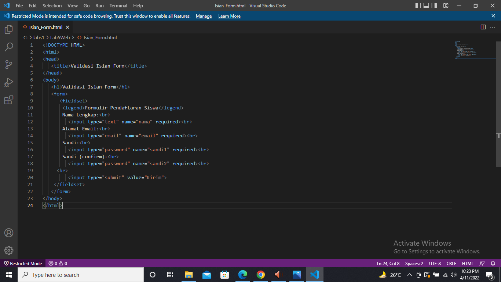

PRATIKUM 5 PEMROGRAMAN WEB

TUGAS INI DIBUAT UNTUK MEMENUHI TUGAS PERTEMUAN 5

Nama    : Mulifatkhul Rachiim

NIM     : 312010180

Kelas   : TI.20.B1

Langkah Pratikum 
1. Buatlah dokumen HTML kemudian Membuat  javascript

Jawaban Latihan
1.Membuat isian Form

setelah di save refresh kembali untuk melihat hasilnya

Sekian & Terimakasih

Semoga bermanfaat

